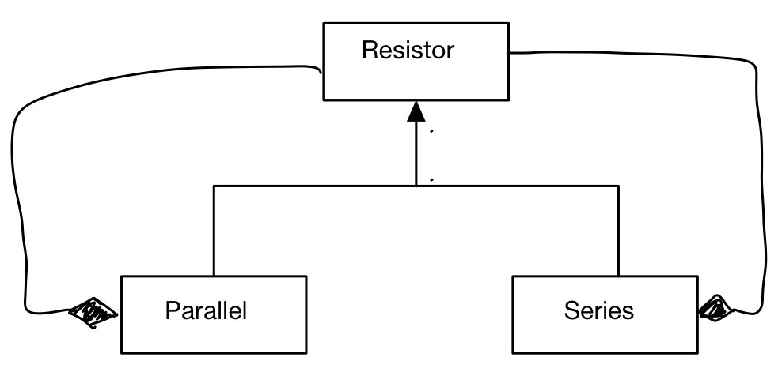

# Laboratory sessions

## Session 1 (19/10/2020)
In this first session we design and implement a new class `Complex` to implement
mathematical operations between `Complex` and regular `double` objects.
- Choose the proper data members for the class
- Implement the constructors
- Implement `re()`, `im()`, `mag()`, `phase()`, `r()`, `phi()` member functions
- overload operators `+,-,*,/` between `Complex` objects
```c++
Complex a(-1,2), b(0.5, 0.9);
Complex c = a/b;
```
- overload operators for operations with a `double` on the rhs
```c++
Complex   i(0,1);
Complex d = i*3 + a + b/2.3 + 1.2;
```
- write global functions (or overload operators) for operations with a `double` on the lhs
```c++
Complex z = 3*i + 2/d;
```

## Session 2 (26/10/2020)
We design and implement a new class `Vector3D` to implement
mathematical operations with 3D vectors
- Choose the proper data members for the class
- Implement the constructors, including a copy constructor
- Take into account different coordinate systems: cartesian, polar, cylindrical
- Implement `r()`, `phi()`, `theta()`, `x()`, `y()`, `z()`  member functions
- overload operators `+,-,*,/` between `Vector3D` objects
```c++
const Vector3D a(-1,2,1), b(0.5, -0.5, 1.5);
Vector3D c = a + b;
```
- overload operators for operations with a `double` on both sides
```c++
Vector3D d = 0.5*a - b/1.5
```
- Implement `scalarProduct()` and `vectorProduct()` functions with appropriate arguments.


## Session 3 (2/11/2020)
The goal of this session is to implement an inheritance hierarchy for polymorphic
classes `Constant`, `Exponential`, and `Polynomial` based on the class [`Function`](examples/Function.h) already discussed during the lecture.
- Implement methods `value()`, `derivative()`, `integrate()` as declared in the header file provided (you cannot change the signature of these methods)
- Overload the `<<` operator for all classes
- Write a program `app.cc` to test your code. For example you can plot your functions in a histogram with ROOT.
- Submit your `Function.{h,cc}`, `Constant.{h,cc}`, `Exponential.{h,cc}`, and `Polynomial.{h,cc}` and the test application `app.cc`

You must separate the declaration (header file) from implementation (source file). Do not change the name of the classes. Make sure the name of the file corresponds to the class.

**Tip:** first implement, compile, and test the `Constant` class with all its methods in your application. Then implement  `Exponential` and make sure it behaves as expected. Finally, implement `Polynomial`.

## Session 4 (9/11/2020)
The scope of this session is the implementation of at least 2 numerical integration Methods
with the [Strategy Pattern](../material/strategy.md) for the `Function` hierarchy implemented last week.

- Implement the `Integrator` base class as discussed at the lecture
- Implement the Monte Carlo method  (`MCIntegrator`)
- Implement the trapezoid or midpoint Method (`MidpointIntegrator`)
- Use a function with known primitive, e.g. `Exponential`, to compare precision of
integration between the two methods and the analytical results
- Make a 1D histogram of the difference `MCMethod-Analytical`, using the ROOT [`TH1F`](https://root.cern.ch/root/htmldoc/guides/users-guide/Histograms.html#histograms) class
  - save the graph as `residual-mc.pdf`
  - make the same plot for the midpoint method
- Plot the difference `MCMethod-Analytical` as a function of trial points `N`, using the ROOT [`TGraph`](https://root.cern.ch/root/html534/guides/users-guide/Graphs.html#tgraph) class
  - save the graph as `residual-mc-tgraph.pdf`
  - make the same plot for the midpoint method
- Once the methods are verified to work, you can integrate other functions, e.g. `Gaussian`, to further test your numerical implementation


## Session 5 (16/11/2020)
Implement the `Parallel` and `Series` of resistors as a polymorphic inheritance hierarchy with the [Composite Pattern](../material/composite.md).



### Class `Resistor`
- two data members: `name_` and `resistance_`
- virtual methods `value()`, `name()`, `print()`
```C++
Resistor ("r1", 1000);
r1.print();
```
should produce
```C++
r1: 1000 Ohm
```
- setter methods `setName()` and `setValue()`

### Class `Parallel`
- data member `components_`: list of `Resistor` pointers
- member function `add()` to add pointers of `Resistor` objects
- virtual method `value()` compute and return the correct value of the resistance by using the `value()` method of its children
```C++
Resistor r1("r1", 100); // assume ohm
Resistor r2("r2", 200);

Parallel p1("p1");
p1.add(&r1);
p1.add(&r2);

cout << "p1 resistance: " << p1.value() << " Ohm" << endl;

r1.setValue(200);

// you should obtain  a new value for p1
cout << "p1 resistance: " << p1.value() << " Ohm" << endl;
```

- `print()` method should show the structure of the `Parallel`. call `print()` recursively for components.
```C++
p1.print();
```
should produce
```C++
Parallel p1: r1 || r2 : 100 Ohm
  r1: 200 ohm
  r2: 200 Ohm
```

### Class `Series`
Same as `Parallel` but with the correct calculation of resistance. Also `print()` function should use ` -- ` instead of `||`


### Optional
- overload of `<<` operator
```C++
cout << r1 << r2 << p1 << endl;
```
   + **tip**: you could modify `print()` in order to use it properly within `<<`

<!--

## Session 2 (11/11/2019)
The scope of this session is to exercise input/output of `TTree` with `TFile`

- Finish implementing class `Complex`
- prepare dictionary for `Complex` to be used in ROOT  
- generate 10'000 random `Complex` numbers with magnitude `r<1`
- create a `TTree` with a single branch that contains a `Complex` object
- Store the `TTree` to disk with `TFile`
- Use `TTree::MakeClass("Analyser")` function to generate the `Analyser` class
from the stored `TTree`
- write a new analysis application to read back the `TTree ` from file using the
new `Analyser` class


## Session 3 (18/11/2019)
The scope of this session is the implementation of at least 2 numerical integration Methods
with the [Strategy Pattern](../lec13/strategy.md).

- Implement the trapezoid or midpoint Method
- Use a function with known primitive, e.f. the exponential, to compare precision of
integration with the MC method


## Session  4 (25/11/2019)
The scope of this session is to read a `TTree` provided by someone else and perform data analysis.
Specifically, the `TTree` with contain generator-level and reconstructed information
from simulated proton-proton collisions. All details at [CODanalysis.md](CODanalysis.md)

## Session 5 (2/12/2019)
Today we simulate the energy loss by ionisation to see the Bethe-Bloch distribution and reproduce the Bragg Peak for the heavy particles.

- define a class Detector with at least density and length as data members and a function *interaction()* to compute dE/dx
  - for simplicity  assume average values for ionisation energy I and Z/A ~ 2
  - You can otherwise have A, Z, I as data members of the class Detector or even define another class *Material*.
  - as a reference, we want to study the distributions in water, Pb, and air.

- Use the [Bethe-Bloch](http://pdg.lbl.gov/2009/reviews/rpp2009-rev-passage-particles-matter.pdf) formula
to compute the average energy loss by ionisation.
- Emulate the effective energy loss as a Gaussian with the mean given by Bethe-Bloch and width of
5% - (\beta\gamma/1000) * 10%.
- check the proper implementation of your class and Bethe-Bloch function by making a 2D plot of energy loss as a function of \beta\gamma.
    - Use TH2F, TGraph, or TProfile  for plotting
    - check that the energy loss, normalized to the density, is universal across different material

Now we want to see the Bragg peak.

- Use a proton with the momentum of 5 MeV going through a target of water
- compute the energy loss and plot the energy loss de/dx as a function of penetration path in the material
- you should now see a peak right before the proton is stopped in the material

We can now study the Bragg peak for different materials, particle types, and momenta.
- material: water, Fe, air
- particles: muon, proton, alpha particle, 12C nucleus
- momentum: 5 MeV, 50 MeV, 500 MeV, 5 GeV

As an example make the following 2 plots
1. for a water detector and initial momentum of 5 MeV, show dE/dx as a function of the path for different types of particles.
use a different color or line type to distinguish the particles.
2. for a water detector make the same plots only for protons, but for the various values of momentum. use different color and line type to show different momenta

## Session 6  (9/12/2019)
In this first session on python,  we simulate the motion of an object in 3D under the effect of gravity.  Use [`matplotlib.mplot3D`](https://matplotlib.org/mpl_toolkits/mplot3d/tutorial.html) module for 3D graphics.
1. implement motion with analytical method and plot the trajectory
2. implement motion with Euler method and plot the trajectory with a different color
3. Plot the distributions of the residuals for `x`, `y`, and `z` coordinates as `(euler-analytical)/analytical`
4. Introduce the friction term as `-\beta v` and use Euler to plot the trajectory
5. Plot the trajectories simultaneously and compare friction to no-friction

## Session 7 (16/12/2019)
Use python to simulate the [Compton scattering spectrum](compton.pdf).

## Session 8 (15/1/2020)
Implement a vicinity sensor with Arduino.
Real time plot with matplotlib. [md](../arduino/arduino.md)

-->
