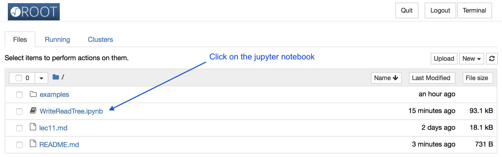

Today's lecture has been written with Markdown and is available as [lec11.md](lec11.md)

There is also a [jupyter](https://jupyter.org) notebook [WriteReadTree.ipunb](WriteReadTree.ipunb) to explain the
writing and reading of a TTree. You can view the notebook as a
document online at the link above, or you can use  ROOT on your
machine to run it interactively.

First open a new terminal
1. download the notebook
```
wget https://raw.githubusercontent.com/rahatlou/CMP/master/lec11/WriteReadTree.ipynb
```
2. run root with jupyter C++ kernel
```
$ROOTSYS/bin/root --notebook
```

3. this will open a new window in your favorite browser. Now select the notebook in the window



4. Finally you can run each cell and see the output

