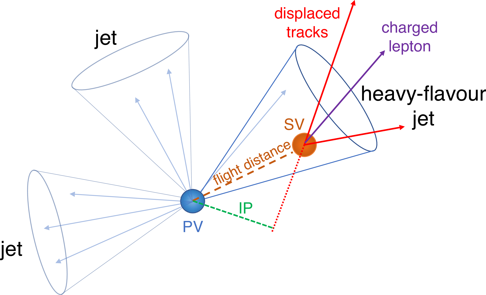
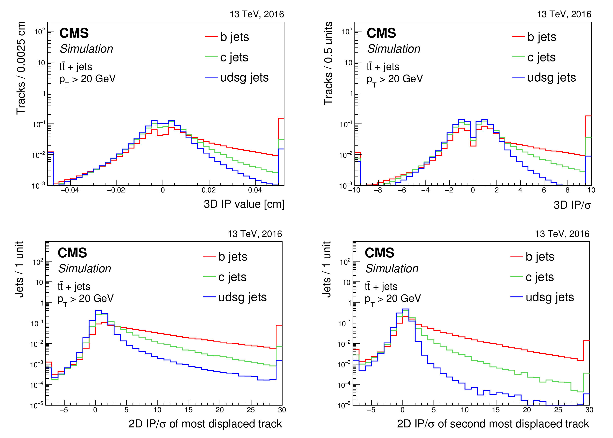
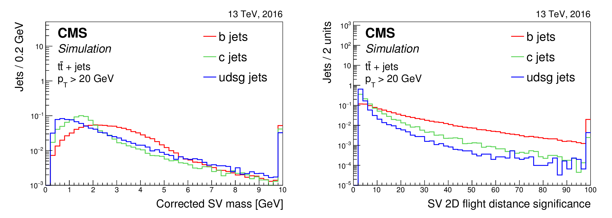
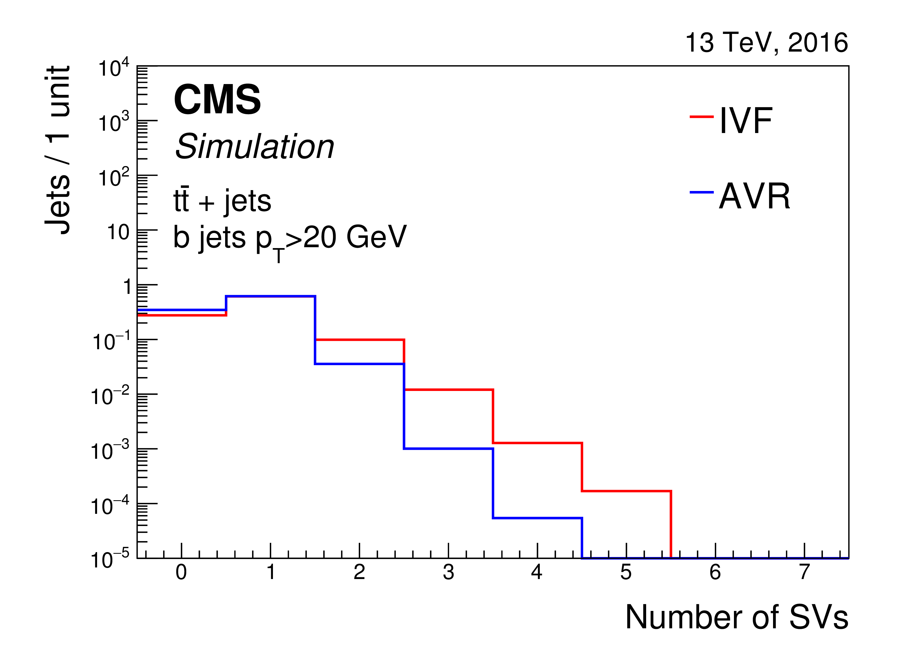
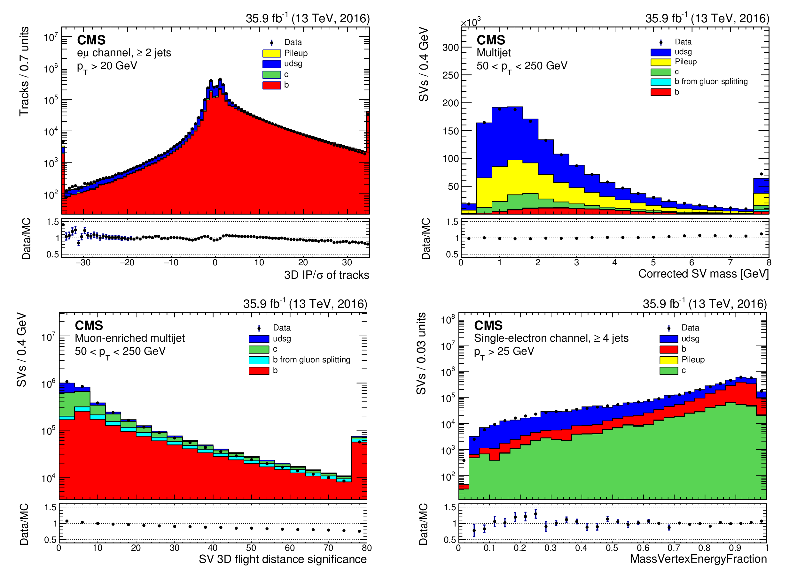
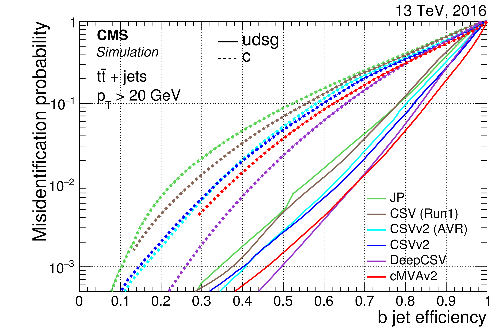

# Introduction to Machine learning

We continue the basic introduction started in [lecture 29](../lec29/lec29.md)

## Advantage of machine Learning
Traditional programming technique for an algorithm in these examples consists in
 1. define rules for classification based on concrete examples
     - examples of already known SPAM
     - identified photons in different geometric configurations and energy range
 1. Write algorithm based on patterns found in examples
 1. test program and add rules to increase accuracy
 1. release program for general use

 List of rules in both cases can become very long if you want to make your algorithm robust. You will have many **if** statements and will have to update often the list.
 If list is not updated, algorithm quickly becomes obsolete and useless
   - think about cheap or free virus protection programs not being updated

 In machine learning approach, rules are not hardcoded. algorithms trained with data to find patterns and update the algorithm.
   - new SPAM emails identified by training
   - new photon distributions found when a new type of process studied in a new energy range or at a new center-of-mass energy

Maintenance in general easier, and results more accurate and reliable.

### Complex problems
Some problems are intrinsically complex and cannot have a simple rule-based solution,  no matter how long the rule-list
  - speech recognition
    - different environment , rooms, conditions, accents
  - image recognition
    - quality of image, perspective, colors, contrast, lighting
  - b-jet identification
    - jet energy and underlying process, number of simultaneous interactions, energy spectrum, number of hadrons

in all these cases the machine learning approach is pretty much your only viable solution.

## Data language
With *data point* we indicate a collection of information concerning an object, an event, or a measurement that can be fed as input to an algorithm. Each type of information is called an **attribute** and together with its value it is a **feature** of the data point.

   - an email has a subject, sender, recipient, body, number of words
   - an apartment has a surface, location, floor, sun exposure, energy class
   - a photon has energy, shape of energy deposit, associated hadronic energy, number of crystals above threshold, fraction of energy in central crystal    

## Types of machine Learning
- A key element of ML is the training of the algorithm.
- ML techniques can be classified according to
  - amount of supervision during training
  - type of supervision during training

### 1. Supervised learning
Training data sample includes the desired result (label) and is used to teach algorithm good from bad
  - sample of good emails and SPAM emails filtered by humans
     - a good email is really a good email (true positive)
     - a SPAM email is a real SPAM (true negative)
  - simulated sample of photons and hadronic jets
    - sample of proton collisions producing two real photons
    - sample of QCD events producing only hadronic jets

 - simulated sample of photons with

### 2. Unsupervised learning
Training data does not have any labels, e.g.  indicating good and bad emails.
Algorithms determine clusters of data based on their features  
- handy for clustering diverse users and clients of a service
- can help identifying correlation between features and a data and reduce number of features to be used (dimentionality reduction)
  - sun exposure and light in an apartment correlated to number of windows
  - mileage of a used car highly correlated with its age
  - energy of a very high energy photon correlated with number of crystals over noise threshold

###  3. Semisupervised learning
Training uses a mixture of  labelled and unlabeled data.
For example algorithm identifies common clusters of data which are then labeled.
Labled data then used for further training.

Photo hosting services use this technique for face recognition
- unsupervised training finds groups of faces that are similar
- user provides label for each group
  - some groups are for same label and are merged
- algorithm uses labeled groups to further classify pictures

###  4. Reinforcement learning
Used heavily in robotics to learn by itself over time.
- A system observes data from environment with no guidance.
- actions are taken and a score is given
  - for example playing chess or Go or other table games
- system learns from its past action by maximising the score

## Stream of data for learning process

Learning techniques can also be classified based on how they use data for training

### Batch learning
Training done with largest sample available and algorithm cannot learn incrementally.
- requests large amount of data and Computing
- algorithm trained for available data and put in production for use

if new features or new sources of data become available, must restart with new training and prepare a new version to be put in production

While the process can be automated, the needs in terms of CPU, storage, memory, and time requirements can be challenging.

In commercial application this can be redone every week or even everyday at computing center, but not realistic on a smartphone.

#### Example: photon identification algorithm
- each year a different configuration of detector subsystems
- possibly different center-of-mass energy in collisions
- improved detector calibration and alignment
- different number of simultaneous collisions

Each year, or even every few months, must do new training for new data sample recorded
- large samples of simulated events must be produced for training

### Incremental or online Learning
Data fed incrementally for training
- training done on subset of data.
- knowledge learned from data stored, but data can be discarded
  - for example on a device with limited resources like a phone or a rover on Mars
- each learning step is relatively fast

Incremental learning can quickly learn and adapt to new conditions and features.

Biggest challenge is the quality of data. Bad data or biased data can mislead an algorithm and make it ineffective
- broken sensor with incorrect reading of radiation or noise or temperature
- SPAM data labeled as good by mistake
- good data wrongly labeled as SPAM

## Main challenges for machine learning
- Amount of quality of data is the main challenge for machine learning.

- Unlike most humans, algorithms need a lot of data and large samples, and also of very good quality to learn good and bad

### non-representative data
- Feed images in day light to train recognition of an object and then apply algorithm to images at night
  - object boundaries not well defined

- Train photon identification for photons with energy below 20 GeV and then apply them to photons with 200 GeV energy
  - energy profile and depth depends on energy

### Poor-quality data
- Features with large uncertainty (noise) will confuse algorithms
  -  a neat image is always better than a noisy or low-quality image for learning  
- Data samples with missing features can make classification more difficult

In general homogenous and comparable samples with high purity make training more efficient and reduce false positives.

### Irrelevant features
ML algorithms are not black boxes. Often people give a large number of features, many perhaps irrelevant or highly correlated, to an algorithm.
- training requires longer time, more resources
- results can be less reliable because of noise introduced  by irrelevant features

It's always better to start with a well understood (certainly in physics analysis) features to train. Then incrementally add features and evaluate gain in performance (accuracy) compared to complexity (evaluation of systematic uncertainties)

### Over-fitting or under-fitting training data
Training is the critical element of any algorithm. Two common problems can happen due to quality and size of data and/or modeling of the data
- complex model is used with non-adequate training sample. The model is over constrained and does not perform well on actual data

- a very simplistic model is used to model a complex and/or large sample and again cannot describe features of realistic and complete data samples

 ### Test and validation
 It is good practice to  define the following samples when using ML Methods
 - large enough sample of training
   - size depends on complexity of problem and model under study
 - a test sample to apply trained algorithm and study its performance
 - the actual datasample where we intend to use the ML algorithm to identify a signal

 Example: b-tagging algorithm to search for exotic new events at LHC
 - large MC samples or pure samples of b-jets from standard model processes such as p-p collisions produce a pair of top quark-antiquark
 - apply algorithm to identify Z -> bb or Higgs -> bb decays
 - use algorithm to search  for new heavy particles decaying to one or more b quarks

## Example of b-tagging algorithm
An example of machine learning in identification of jets from heavy flavor quarks is described in [this document](http://cms-results.web.cern.ch/cms-results/public-results/publications/BTV-16-002/index.html) using LHC data recorded with the CMS detector.

**Task**: separating hadronic jets from b and c quarks and those from u,d,s quarks and gluons

Useful attributes include:
- distance between tracks and the axis of the jet at point of closest approach  

- average track multiplicity in jets as a function of their pt and $\eta$ 

- 3D impact parameter value and its significance. 2D impact parameter for 1st and 2nd most energetic tracks 

- distribution of secondary vertex mass and flight distance in 2D 

- number of secondary vertices inside a b-jet 

Distributions are compared between data and MC to make sure results and performance obtained with simulation can be applied to data.

**Training data**:

- signal:  simulated sample of pair production of top quarks  

- background: QCD multijet events

**Performance**:
ROC curve for different algorithms using same input data but different ML algorithms compared to traditional likelihood based algorithm JP(jet probability).

## ML exercise with arduino
- program an accelerator module to record movement data on SD card on the board
- collect data in different conditions
  - walking slowly
  - walking fast
  - running
- identify list of attributes to be used by a ML algorithm to distinguish each activity
  - vertical and horizontal acceleration
  - oscillation of average position
  - frequency of oscillation

- use [matplotlib](https://matplotlib.org) for visualization of data

- convert data to use [pandas](http://pandas.pydata.org) [DataFrame](https://pandas.pydata.org/pandas-docs/version/0.23.4/generated/pandas.DataFrame.html) instead of simple NumPy ndarray
- use [scikit-learn](https://scikit-learn.org/stable/) to do classification using for example boosted trees
