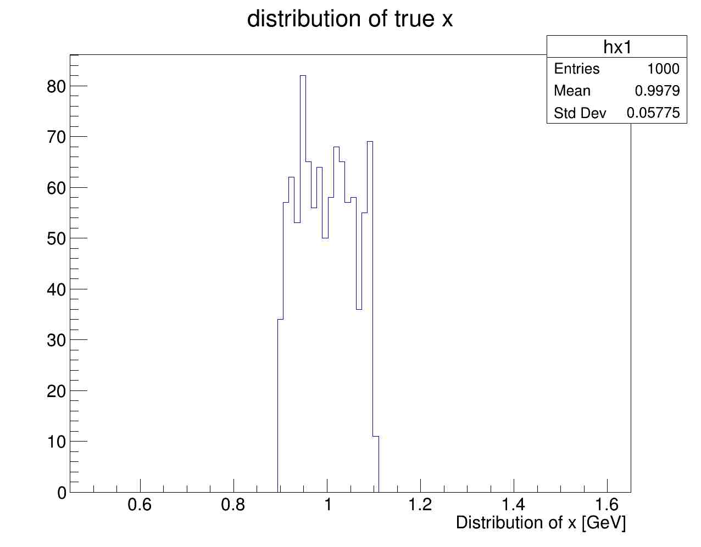
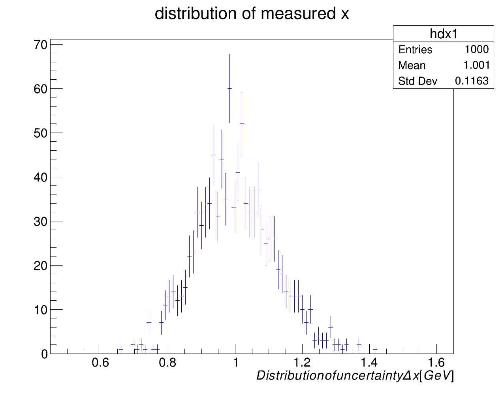
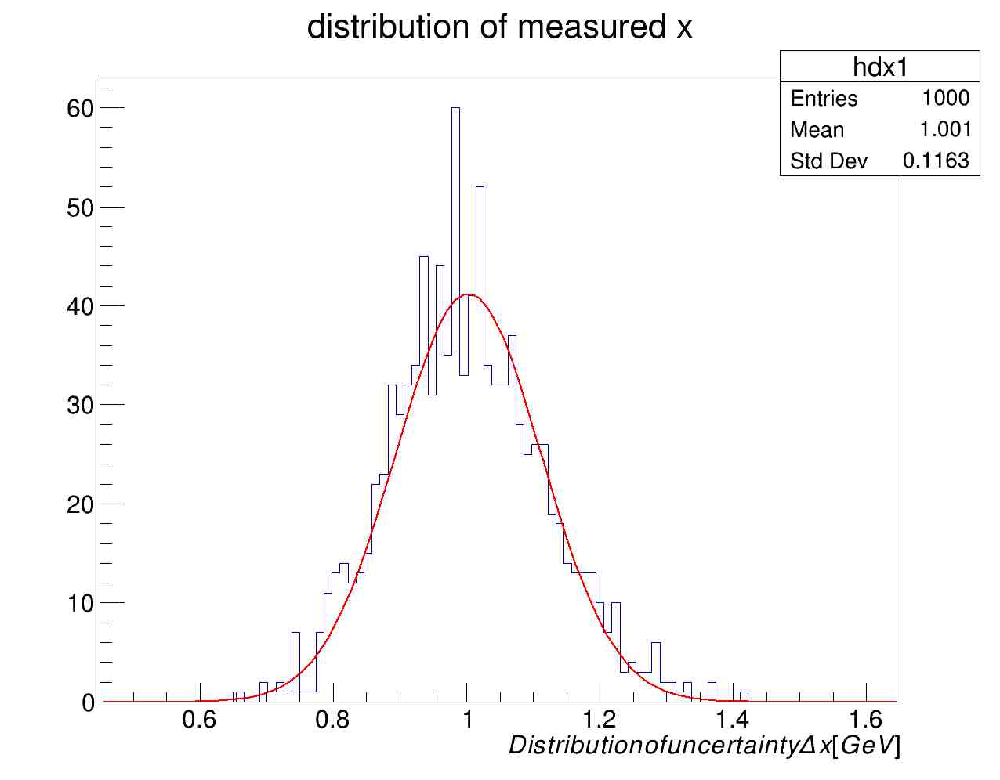

# Input/output in ROOT: data storage with [TFile](https://root.cern.ch/doc/master/classTFile.html)

## Data storage
- So far you have mainly used text files to store data in your programs and perform analysis.
- this solution cannot scale when you have a large sample of data to be measured, stored, and analysed
- Binary files with dedicated storage containers provide an efficient solution

## Storage of custom objects

- Another problem is storage of objects of custom types instead of built-in types such as `int`, `double`, `float`, or `string`
- And what about histograms such as `TH1F` and more advanced objects used in `ROOT`, or even your `Datum`, `Vector3D` or `Complex` objects ?

### [TFile](https://root.cern.ch/doc/master/classTFile.html)
- In ROOT we use the File class for storage of data
- Detailed description of the class is available in the [user guide](https://root.cern/root/htmldoc/guides/users-guide/ROOTUsersGuide.html#inputoutput)
- TFile is similar to a UNIX directory
  * it can contain directories and objects
  * objects are stored in machine independent format  

- To use a TFile object you need to include its header
``` c++
// ... some code...
#include "TFile.h"
TFile f("outputfile.root");
```

## Generation of random numbers in ROOT

- ROOT has several random number generators
- For a summary of available generators see the reference for [TRandom](https://root.cern.ch/doc/master/classTRandom.html)
  * we will be using the [TRandom3 class](https://root.cern.ch/doc/master/classTRandom.html) in our examples
- TRandom provides generators for a number of commonly used functions
  * Uniform
  * Gaussian
  * Exponential
  * Breit-Wigner
  * Binomial
  * Poisson
  * Landau
- It also has functions to generate custom random numbers
  * from an existing histogram
  * from a custom function

## Example: filling histograms and storage to TFile
The complete example is available as [examples/02-app3](../examples/ROOT/02-app3.cc)

first include all necessary header files:
```c++
// standard library header files
#include <iostream>

// ROOT heder files
#include "TRandom3.h"

#include "TH1F.h"
#include "TCanvas.h"

#include "TFile.h"
```
for the time being we are not using the command line variables.

```c++
int main( int argc, char* argv[]) {
```
Open the ROOT file and make sure the file was opened successfully.
Typical cause for failure
- wrong path
- no write privilege

```c++
  // Open TFile for output. Overwite output file if it already exists
  TString rootfname("/tmp/output.root");
  TFile rfile( rootfname, "RECREATE");
  if( !rfile.IsOpen() ) {
    std::cout << "problems creating root file. existing... " << std::endl;
    exit(-1);
  }
  std::cout << "storing output in root file " << rootfname << std::endl;
```

We want to generate the true value of the observable in a given range and then take into acclount the detector resolution to generate the measured value in the detector.

```c++
  // generate random true value in the range [x1,x2]
  // generate the measurement by accounting for a guassian resolution of 10%

  double x1=0.9, x2=1.1;
  double resol = 0.10;
```
Create new histograms to look at true and measured distributions. Note the histogram limits are set as a function of interval  and resolution.

```c++
  // create histograms
  int nbins = 100;
  double xlo = x1*(1-5*resol);
  double xhi = x2*(1+5*resol);
  double binwidth = (xhi-xlo) / nbins;
  std::cout << "# bins: " << nbins << "\t bin width: " << binwidth << std::endl;

  TH1F hx1("hx1", "distribution of true x",
	     nbins, xlo, xhi );

  TH1F hdx1("hdx1", "distribution of measured x",
	    nbins, xlo , xhi );
```

Use the root random generator and initialize the seed
```c++
  //new random generator
  TRandom3*  gen = new TRandom3();
  gen->SetSeed(0); //use machine clock
```
The true values have a flat distribution.

The measured values take into account the detector resolution that depends on the true value.
```c++
  // # measurements
  int nsig = 1000;

  for(int i=0; i< nsig; ++i) {


    // genarate true value
    double x = x1 + gen->Uniform(x2-x1);

    //generate meaured value based on the true value and resolution
    double dx = gen->Gaus(x, x*resol);

    // fill histograms
    hx1.Fill(x);
    hdx1.Fill(dx);

  }
```
After generating the data we now take care of plotting. We also change some histogram properties to make them nicer.
```c++
  // create canvas
  TCanvas canv("canv", "canvas for plotting", 1280, 1024);

  // make histograms nicer and store to file
  hx1.GetXaxis()->SetTitle("Distribution of x [GeV]");
  hx1.Draw();
  canv.SaveAs("/tmp/x.pdf");

  hdx1.GetXaxis()->SetTitle("Distribution of uncertainty \\Delta x [GeV]");
  hdx1.Draw("pe"); // show points with error bars
  canv.SaveAs("/tmp/dx.pdf");
```



A simple example of fitiing with predefined functions. For more options see the ROOT [user guide on fitting histograms](https://root.cern.ch/root/htmldoc/guides/users-guide/FittingHistograms.html)
```c++
  // fit histogram with predefined Gaussian function
  hdx1.Fit("gaus");
  hdx1.Draw();
  canv.SaveAs("/tmp/dxfit.pdf");
```


we can now delete the generator
```c++
  // delete the random generator
  delete gen;
```
histograms as objects can be written to
```c++
  // store histograms to file
  hx1.Write();
  hdx1.Write();

  // close root file
  rfile.Close();

  return 0;
}
```
This is the output when running the program
```sh
$ /tmp/app
storing output in root file /tmp/output.root
# bins: 100	 bin width: 0.012
Info in <TCanvas::Print>: pdf file /tmp/x.pdf has been created
Info in <TCanvas::Print>: pdf file /tmp/dx.pdf has been created
 FCN=53.7499 FROM MIGRAD    STATUS=CONVERGED      69 CALLS          70 TOTAL
                     EDM=1.29868e-08    STRATEGY= 1      ERROR MATRIX ACCURATE
  EXT PARAMETER                                   STEP         FIRST   
  NO.   NAME      VALUE            ERROR          SIZE      DERIVATIVE
   1  Constant     3.97103e+01   1.65753e+00   4.66441e-03   4.33139e-05
   2  Mean         9.99764e-01   3.93885e-03   1.37562e-05   3.37032e-02
   3  Sigma        1.14658e-01   3.12987e-03   2.49340e-05   1.00617e-02
Info in <TCanvas::Print>: pdf file /tmp/dxfit.pdf has been created

```

### Quesrtions
- What is the standard deviation of the measured values?
- What the width of the fitted Gaussian ?
- How does the measured values compare to your expecation?

### Exercise
- use command line to pass the name of the output file to programs
- use command line to specify the number of measurements and the resolution

# TTree for data storage

The [`TTree`](https://root.cern.ch/doc/master/classTTree.html) class has been designed to store large number of objects of the same class into file. For a detailed description see the [ROOT user guide on `TTree`](https://root.cern.ch/root/htmldoc/guides/users-guide/Trees.html).

### Tree structure
The tree is the prototype of the data structure to be stored. It is made of branches which can have as many leaves as your data points.

Each branch contains a distinct collection of objects of the same class. So in data analysis each variable, e.g. `x`, `energy`, `track` corresponds to a Branch. The copies of data (for each measurement or experiment) are the leaves of the branch.

### Examples
A number of [examples](../examples/ROOT/) are provided to write and read simple type of trees:

- Fill TTree and store in TFile:  [04-writeTree.cc](../examples/ROOT/04-writeTree.cc)
- Read TTree from file and fill histograms: [06-readTree.cc](../examples/ROOT/06-readTree.cc)
- Fill TTree with variable size branch and store in TFile: [07-writeObjects.cc](../examples/ROOT/07-writeObjects.cc)
- Read TTree from file and fill 1D and 2D histograms:[08-readTree.cc](../examples/ROOT/08-readTree.cc)

## Fill a simple Tree and store in TFile
The complete example is in [04-writeTree.cc](../examples/ROOT/04-writeTree.cc)

First open a root file and create a new TTree object
```c++
// ==== store data in a TTree

TString rootfname("/tmp/dati.root");
TFile* orootfile = new TFile( rootfname, "RECREATE");
if( !orootfile->IsOpen() ) {
  std::cout << "problems creating root file. existing... " << std::endl;
  exit(-1);
}
std::cout << "storing output in root file " << rootfname << std::endl;

TTree* tree = new TTree("datatree","tree containg our data");
```
the name of the `TTree` object, in this case `datatree`, and not the name of the C++ variable (`tree`) is important because ROOT stores all objects in a `TFile` with their name.

In order to store two scalar variables `x` and `dx` in the tree
```c++
// variables to be stored in the tree
double x, dx;
```
we set the reference to them in the two branches `value` and `error` of the tree
```c++
// now set the info for each branch of the tree to correspond to our data
tree->Branch("value", &x,  "value/D");
tree->Branch("error", &dx, "error/D");
```
note that there is no correlation between the name of the variable `x` and the name of the branch `value`.
The `Branch` function has 3 arguments
- name of the branch (`"value"`)
- pointer to variable in memory (`&x`)
- type of the variable in the branch (`"value/D"` which is a `double`)

Next we
- iterate over the data to be stored
- assign the values to `x` and `dx`
- Fill the tree
```c++
for(std::vector<Datum>::const_iterator it = dati.begin(); it != dati.end(); ++it) {
  // assign values to  C++ variables that are going to be stored in the branch
  x = it->value();
  dx = it->error();

  tree->Fill(); // store data in tree IN MEMORY
}
```
Finally in order to store the data to file
```c++
// now actually write tree in file on disk
tree->Write();

// critical to close the file!
orootfile->Close();
```
before closing the root file.

## Read TTree from file
The complete example is in [06-readTree.cc](../examples/ROOT/06-readTree.cc).

In order to access the data in a tree you need
- name of the ROOT file where the tree is stored (`/tmp/dati.root`")
- the name of the tree object (`datatree`)
- the name of the branches (`value` and `error`)

First open the ROOT file
```c++
TString rootfname("/tmp/dati.root");
TFile* orootfile = new TFile( rootfname );
if( !orootfile->IsOpen() ) {
  std::cout << "problems opening root file. existing... " << std::endl;
  exit(-1);
}
std::cout << "Reading data from root file " << rootfname << std::endl;
```
and retrieve a pointer to the tree object
```c++
// get pointer to tree object stored in the file
TTree* tree = (TTree*) orootfile->Get("datatree");
if(!tree) {
  std::cout << "null pointer for TTree! exiting..." << std::endl;
  exit(-1);
}
```
note the explicit cast of the tree object to `TTree*`.

Then declare the C++ variables to access the data in the branches, and set the branch address accordingly
```c++
// variables to be read from the tree
double y, dy;

// now set the info for each branch of the tree to correspond to our data
tree->SetBranchAddress("value", &y);
tree->SetBranchAddress("error", &dy);
```
Finally iterate over the entries in the tree and fill histograms or do any calculation
```c++
int nentries = tree->GetEntries();
for (int i=0; i<nentries; ++i) {
  tree->GetEntry(i); // read data from file to memory

  hx1.Fill(y);
  hdx1.Fill (dy);
}
```
Note that the `TTree::GetEntry()` call is what populates the `y` and `dy` variables
from the data in the tree on disk.

## Trees with variable size branches
Complete example in [07-writeObjects.cc](../examples/ROOT/07-writeObjects.cc)

In the previous example, each event has exactly one `value` and `error` stored. In reality, often we have to deal with situations were the number of objects to be stored varies across the events. For example, if we want to store the energy for all photons produced in a collision. The number of photons will be different in each event. The simplest way is to use fixed-size C-style arrays.

For example we want to store `nmeas` values of `x` and `dx` for `nexp` events, where `nmeas` has a different value for each experiment, e.g. according to a Poisson distribution.

First declare the variables
```c++
// variables to be stored in the tree
const int nMeasMax=200; // maximum size of static array per event
double x0, x[nMeasMax], dx[nMeasMax];
int nmeas;
```
we assume that the number of measurements will never exceed nMeasMax. This ugly limitation can be overcome in a future example `std::vector<T>`.

```c++
// now set the info for each branch of the tree to correspond to our data
tree->Branch("nmeas", &nmeas, "nmeas/I");
tree->Branch("value", x,  "value[nmeas]/D"); // nmeas is the index of value[]
tree->Branch("error", dx, "error[nmeas]/D"); // and error[] in the tree
```
note that we have a new branch to store `nmeas` which is used as the index for the array `value[nmeas]`

`nmeas` is extracted from a Poisson distribution. Arrays are filled before filling the tree
```c++
// # measurements
int nMeasAvg=50;
int nexp = 1000;

for(int iexp=0; iexp<nexp; iexp++) {

  nmeas = gen->Poisson(nMeasAvg);

  if( nmeas > nMeasMax ) {
    std::cout << "WARNING: nmeas > " << nMeasMax << " your TTRee will be corrupted" << std::endl;
  }

  for(int i=0; i< nmeas; ++i) {

    // genarate true value
    x0 = x1 + gen->Uniform(x2-x1);

    //generate meaured value based on the true value and resolution
    x[i] = gen->Gaus(x0, x0*resol);

    //generate an uncertainty based on the resolution
    dx[i] = x[i] * resol;
  }

  tree->Fill(); // write the data from memory to file at end of each experiment
```
and finally store the tree
```c++
} // end of experiments
tree->Write();
```

Reading the tree also requires some changes to account for the arrays (see the complete example in [08-readTree.cc](../examples/ROOT/08-readTree.cc))

Declare the variables and set the address for the branches
```c++
// variables to be read from the tree
const int nMeasMax = 200;
double y[nMeasMax], dy[nMeasMax];
int nmeas;

// now set the info for each branch of the tree to correspond to our data
tree->SetBranchAddress("value", y);
tree->SetBranchAddress("error", dy);
tree->SetBranchAddress("nmeas", &nmeas);
```
iterate over events in the tree, and for each event iterate over measurements
```c++
int nentries = tree->GetEntries();
for (int iexp=0; iexp<nentries; ++iexp) {
  tree->GetEntry(iexp); // read data from file to memory

  hnmeas.Fill(nmeas);

  // for each experiment read the measurements
  for(int i = 0; i< nmeas; ++i) {
    hdx1.Fill( dy[i] );
  } // loop on mesurements
} // end of experiments
```
# Trees with custom objects

## Storing custom objects in TTree

First we need to tell ROOT about our class and its interface. This requires generating a Dictionary for your class.
For example suppose we want to store `Datum` objects in TTree branches.

Generate dictionary for `Datum`
```
$ROOTSYS/bin/rootcint -f MyDict.cxx Datum.h
```

This will create a new file `MyDict.cxx`. You can check it was successful by compiling it
```
g++ -c `$ROOTSYS/bin/root-config --cflags` MyDict.cxx
```
If everything worked fine you will see
```
ls MyDict*
MyDict.cxx        MyDict.o          MyDict_rdict.pcm
```


Now we write a program to store Datum in branches. For example [03-writeCustomObject.cc](../examples/ROOT/03-writeCustomObject.cc)

First you need to add these additional lines in your application
```c++
// my header files
#include "Datum.h"

#ifdef __MAKECINT__
#pragma link C++ class Datum+;
#endif
```

Then you add a new branch for your Datum object
```c++
 // create the tree
  TTree* tree = new TTree("datatree","tree containg our data");

  // variables to be stored in the tree
  Datum  dato;

  // now set the info for each branch of the tree to correspond to our data
  tree->Branch("datum", &dato);
  ```

Generate pseudo-measurements and add data to the tree
```c++
for(int i=0; i< nmeas; ++i) {
  // genarate value
  double x0 = x1 + gen->Uniform(x2-x1);
  double x = gen->Gaus(x0 , x0*resol);
  double err =  (x2-x1)/sqrt(12);
  dato = Datum( x,  gen->Gaus(err , err*0.10) );

  // add leaf to the  tree
  tree->Fill();
}
```

Link you application, adding also the dictionary `MyDict.cxx` in addition to `Datum.cc`
```
g++ -o /tmp/03-write  03-writeCustomObject.cc Datum.cc MyDict.cxx `$ROOTSYS/bin/root-config --libs --cflags`
```
and run
```
/tmp/03-write
storing output in root file /tmp/dati.root
```
you should now see there is only one branch in your tree called `datum`


## Reading custom objects from TTree

We now want to write a new application
[04-readTreeCustomObject.cc](../examples/ROOT/04-readTreeCustomObject.cc) to read
back the `Datum` objects stored in the root file from the previous example.

After opening the file and getting a pointer to the TTree
```c++
  TString rootfname("/tmp/dati.root");
  TFile* orootfile = new TFile( rootfname );
  if( !orootfile->IsOpen() ) {
    std::cout << "problems opdening root file. existing... " << std::endl;
    exit(-1);
  }
  std::cout << "Reading data from root file " << rootfname << std::endl;
  ```
  You need as usual to set the branch address to read the data
  ```c++
  // Pointer to a Datum object to be read from Branch
  Datum* d=0;

  // now set the info for each branch of the tree to correspond to our data
  tree->SetBranchAddress("datum", &d);
  ```
  *Note that you are setting the address of a pointer  to a Datum
  object in the branch!*

As usual you can now loop over all the entries in the tree and access
your Datum object which is the leaf of the tree
```c++
  int nentries = tree->GetEntries();
  for (int i=0; i<nentries; ++i) {
    tree->GetEntry(i); // read data from file to memory

    hx1.Fill( d->value() );
    hdx1.Fill ( d->error() );
  }
  ```

Link the new executable `read`
```
g++ -o /tmp/04-read 04-readTreeCustomObject.cc  Datum.cc MyDict.cxx `$ROOTSYS/bin/root-config --libs --cflags`
```

and run it
```
/tmp/04-read
# bins: 50	 bin width: 0.02
Reading data from root file /tmp/dati.root
Info in <TCanvas::Print>: pdf file /tmp/newplots.pdf has been created
```

You will notice that this time the plots correctly report also the
entries per bin width in the Y axis label. This is done with the
[TString::Form()](https://root.cern.ch/doc/v614/classTString.html#aeb44d6183d8b1f1b7090dbd3c93f5e39)
function which has a syntax very similar to `sprintf` in C.

```c++
  TH1F hx1("hx1", "distribution of x values",
	     nbins, x1, x2 );

  // use TString::Form() function to add correct y axis label with bin width
  hx1.GetYaxis()->SetTitle(Form("entries/%.3f", binwidth));
```


# Using TTree not created by you

Very often you will have to analyse data stored in a TTree not created
by you. This is typical in particle physics experiments.

In principle, to write an application to read the
TTree, you need the list and types of all branches in order to
`BranchSetAddress` for each of them. This can be both **painful** and
**tedious** to do. Luckily this part can be generated automatically by
ROOT.

Let's assume you have `/tmp/dati01.root` created by
[07-writeObjects.cc](../examples/ROOT/07-writeObjects.cc)

```bash
g++ -o /tmp/01-write 01-writeObjects.cc `$ROOTSYS/bin/root-config --libs --cflags`
/tmp/01-write
storing output in root file /tmp/dati01.root
```

You can inspect and create a skeleton for a class based on the Tree
object
```
root /tmp/dati01.root
   ------------------------------------------------------------
  | Welcome to ROOT 6.14/00                http://root.cern.ch |
  |                               (c) 1995-2018, The ROOT Team |
  | Built for macosx64                                         |
  | From tag v6-14-00, 13 June 2018                            |
  | Try '.help', '.demo', '.license', '.credits', '.quit'/'.q' |
   ------------------------------------------------------------

root [0]
Attaching file /tmp/dati.root as _file0...
(TFile *) 0x7fe4798df040
root [1] .ls
TFile**		/tmp/dati01.root
 TFile*		/tmp/dati01.root
  KEY: TTree	datatree;1	tree containg our data
root [2] datatree->Print()
******************************************************************************
*Tree    :datatree  : tree containg our data                                 *
*Entries :      100 : Total =           19069 bytes  File  Size =      17615 *
*        :          : Tree compression factor =   1.01                       *
******************************************************************************
*Br    0 :nmeas     : nmeas/I                                                *
*Entries :      100 : Total  Size=        961 bytes  File Size  =        279 *
*Baskets :        1 : Basket Size=      32000 bytes  Compression=   1.71     *
*............................................................................*
*Br    1 :value     : value[nmeas]/D                                         *
*Entries :      100 : Total  Size=       8932 bytes  File Size  =       8348 *
*Baskets :        1 : Basket Size=      32000 bytes  Compression=   1.00     *
*............................................................................*
*Br    2 :error     : error[nmeas]/D                                         *
*Entries :      100 : Total  Size=       8932 bytes  File Size  =       8348 *
*Baskets :        1 : Basket Size=      32000 bytes  Compression=   1.00     *
*............................................................................*
root [3] datatree->MakeClass("DataTree");
...
ignore the errors and warnings about libHbook and libFortran
Info in <TTreePlayer::MakeClass>: Files: DataTree.h and DataTree.C generated from TTree: datatree
```
this will generate 2 files `DataTree.h` and `DataTree.C`

Let's start with taking a look at [`DataTree.h`](../examples/ROOT/DataTree.h)
```c++
//////////////////////////////////////////////////////////
// This class has been automatically generated on
// Tue Oct 23 11:32:33 2018 by ROOT version 6.14/00
// from TTree datatree/tree containg our data
// found on file: /tmp/dati.root
//////////////////////////////////////////////////////////

#ifndef DataTree_h
#define DataTree_h

#include <TROOT.h>
#include <TChain.h>
#include <TFile.h>

// Header file for the classes stored in the TTree if any.

class DataTree {
public :
   TTree          *fChain;   //!pointer to the analyzed TTree or TChain
   Int_t           fCurrent; //!current Tree number in a TChain

// Fixed size dimensions of array or collections stored in the TTree if any.

   // Declaration of leaf types
   Int_t           nmeas;
   Double_t        value[17];   //[nmeas]  you need to change by hand  17 -> 200
   Double_t        error[17];   //[nmeas]  you need to change by hand  17 -> 200
    // List of branches
   TBranch        *b_nmeas;   //!
   TBranch        *b_value;   //!
   TBranch        *b_error;   //!

   DataTree(TTree *tree=0);
   virtual ~DataTree();
   virtual Int_t    Cut(Long64_t entry);
   virtual Int_t    GetEntry(Long64_t entry);
   virtual Long64_t LoadTree(Long64_t entry);
   virtual void     Init(TTree *tree);
   virtual void     Loop();
   virtual Bool_t   Notify();
   virtual void     Show(Long64_t entry = -1);
};

#endif
```
 you notice that `17` is a non-typical value! It is that maximum
 length of the array in the tree. You need to modify this by hand and set it to a *large value* based on infortmation provided to you
   by whoever created the root file. This is yet another unfortunate example of static C arrays. We will change this to be `200`.

You wil also notice that  [`DataTree.h`](../examples/ROOT/DataTree.h) implements also most of the
class member functions
```c++
#ifdef DataTree_cxx
DataTree::DataTree(TTree *tree) : fChain(0)
{
// if parameter tree is not specified (or zero), connect the file
// used to generate this class and read the Tree.
   if (tree == 0) {
      TFile *f = (TFile*)gROOT->GetListOfFiles()->FindObject("/tmp/dati.root");
      if (!f || !f->IsOpen()) {
         f = new TFile("/tmp/dati.root");
      }
      f->GetObject("datatree",tree);

   }
   Init(tree);
}
```
The constor needs a pointer to a TTree in order to build a new
   DataTree object. It is better to change the the defult behaviour to
   avoid problems in the future

```c++
#ifdef DataTree_cxx
#include<iostream>
DataTree::DataTree(TTree *tree) : fChain(0)
{
// if parameter tree is not specified (or zero) exit
   if (tree == 0) {
        std::cout << "No tree has been provided. exiting!" << std::endl;
        exit(-1)
      }
      f->GetObject("datatree",tree);

   }
   Init(tree);
}
```


The rest of the code in  [`DataTree.h`](../examples/ROOT/DataTree.h) can be left unchanged:
```c++
DataTree::~DataTree()
{
   if (!fChain) return;
   delete fChain->GetCurrentFile();
}

Int_t DataTree::GetEntry(Long64_t entry)
{
// Read contents of entry.
   if (!fChain) return 0;
   return fChain->GetEntry(entry);
}
Long64_t DataTree::LoadTree(Long64_t entry)
{
// Set the environment to read one entry
   if (!fChain) return -5;
   Long64_t centry = fChain->LoadTree(entry);
   if (centry < 0) return centry;
   if (fChain->GetTreeNumber() != fCurrent) {
      fCurrent = fChain->GetTreeNumber();
      Notify();
   }
   return centry;
}
```
In particular the `Init()` function does set the Branch Adderess
correctly for all branches in the tree.

```c++
void DataTree::Init(TTree *tree)
{
   // The Init() function is called when the selector needs to initialize
   // a new tree or chain. Typically here the branch addresses and branch
   // pointers of the tree will be set.
   // It is normally not necessary to make changes to the generated
   // code, but the routine can be extended by the user if needed.
   // Init() will be called many times when running on PROOF
   // (once per file to be processed).

   // Set branch addresses and branch pointers
   if (!tree) return;
   fChain = tree;
   fCurrent = -1;
   fChain->SetMakeClass(1);

   fChain->SetBranchAddress("nmeas", &nmeas, &b_nmeas);
   fChain->SetBranchAddress("value", value, &b_value);
   fChain->SetBranchAddress("error", error, &b_error);
   Notify();
}

Bool_t DataTree::Notify()
{
   // The Notify() function is called when a new file is opened. This
   // can be either for a new TTree in a TChain or when when a new TTree
   // is started when using PROOF. It is normally not necessary to make changes
   // to the generated code, but the routine can be extended by the
   // user if needed. The return value is currently not used.

   return kTRUE;
}

void DataTree::Show(Long64_t entry)
{
// Print contents of entry.
// If entry is not specified, print current entry
   if (!fChain) return;
   fChain->Show(entry);
}
Int_t DataTree::Cut(Long64_t entry)
{
// This function may be called from Loop.
// returns  1 if entry is accepted.
// returns -1 otherwise.
   return 1;
}
```
Looking at  [`DataTreeORIG.C`](../examples/ROOT/DataTreeORIG.C) generated by `ROOT` it implements the most
important function DataTree::Loop() which is used to analyse the
data in the TTree.

```c++
#define DataTree_cxx
#include "DataTree.h"
#include <TH2.h>
#include <TStyle.h>
#include <TCanvas.h>

void DataTree::Loop()
{
   if (fChain == 0) return;

   Long64_t nentries = fChain->GetEntriesFast();

   Long64_t nbytes = 0, nb = 0;
   for (Long64_t jentry=0; jentry<nentries;jentry++) {
      Long64_t ientry = LoadTree(jentry);
      if (ientry < 0) break;
      nb = fChain->GetEntry(jentry);   nbytes += nb;
      // if (Cut(ientry) < 0) continue;
   }
}
```
This is the file to be modified by you to add your custom analysis code.
In [`DataTree.C`](../examples/ROOT/DataTree.C) you see an example of a modified `Loop()` function to
- open a new output ROOT file
- book histograms
- loop over events
- do some calculations
- plot histograms and save them in a pdf file
- store objects in the outout root file
```c++
void DataTree::Loop()
{
   if (fChain == 0) return;

   // create a new TFile to store output
   // this is a different file from the one where the inout data is stored
   TFile outfile("/tmp/analysis.root","RECREATE");

   // book histograms
   TH1F  hx("hx","distribution of all x", 50, 0.4, 1.8);
   TH1F  hxmean("hxmean","distribution of average x per experiment", 50, 0.9, 1.1);

   TH1F  hdx("hdx","distribution of all \\deltax", 50, 0., 0.1);
   TH1F  hdxstdev("hdxstdev","distribution of Std. Dev of \\deltax per experiment", 50, 0., 0.01);

   TH1F  hxSmalldx("hxSmalldx","distribution of all x with small errors", 100, 0.5, 2.5);

   TH2F  hdxvsxall("hdxvsxall", "\\deltax vs x",50, 0.4, 1.8, 50, 0., 0.1 );


   // loop over events in the tree
   Long64_t nentries = fChain->GetEntriesFast();

   Long64_t nbytes = 0, nb = 0;
   for (Long64_t jentry=0; jentry<nentries;jentry++) {
      Long64_t ientry = LoadTree(jentry);
      if (ientry < 0) break;
      nb = fChain->GetEntry(jentry);   nbytes += nb;
      // if (Cut(ientry) < 0) continue;

      // ---- add your code here to do analysis with data in the Tree
      if(jentry%5==0) std::cout << "processing event: " << jentry << std::endl;

      // reset histograms to compute mean and std Dev
      //hx->Clear();
      hx.Clear();
      hdx.Clear();

      // loop over measurements in this event
      for(int im=0; im < nmeas; im++) {
        // fill histos to compute mean and stdev for each experiment/event
        //hx->Fill(value[im]);
        hx.Fill(value[im]);
        hdx.Fill(error[im]);

        hdxvsxall.Fill( value[im], error[im] );

        // only plot value for small errors
        if(error[im]<0.05) hxSmalldx.Fill(value[im]);
      }

      // fill histo with info for each event/experiment
      hxmean.Fill( hx.GetMean() );
      hdxstdev.Fill( hdx.GetStdDev() );

      // --- end of analysis code
   } // end of event Loop


   // make newplots
   TCanvas* c1 = new TCanvas("c1","canvas", 1280,1024);
   c1->Divide(2,2);
   gStyle->SetOptStat(111111);

   c1->cd(1);

   hxmean.Draw();

   c1->cd(2);
   hdxstdev.Draw();

   c1->cd(3);
   hxSmalldx.Draw();

   c1->cd(4);
   hdxvsxall.Draw("colz3");

   c1->SaveAs("/tmp/analysisPlots.pdf");

  // write objects to output file
  hxmean.Write();
  hdxstdev.Write();
  hxSmalldx.Write();
  hdxvsxall.Write();
  c1->Write();

  // close outout file
  outfile.Close();

}
```
